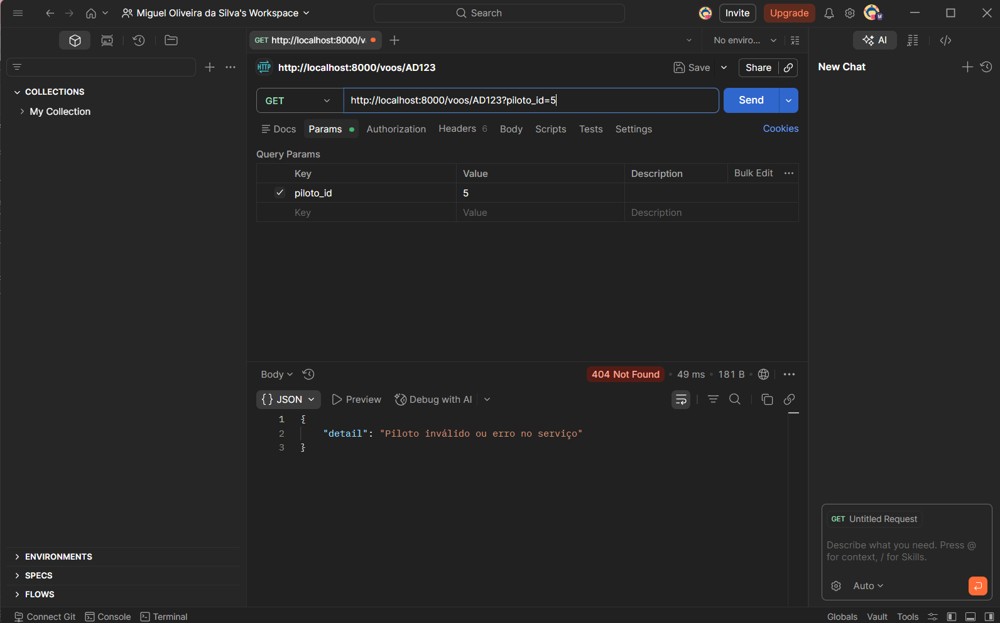
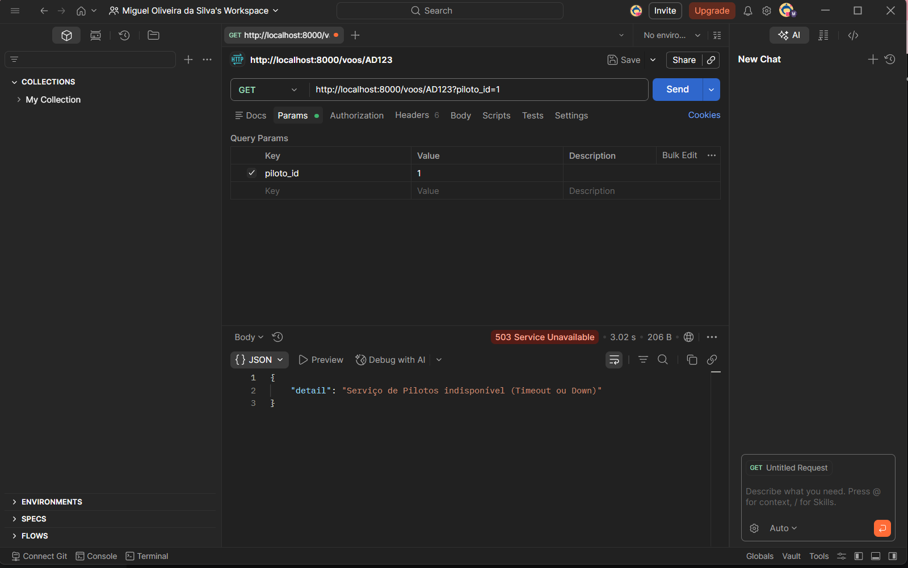
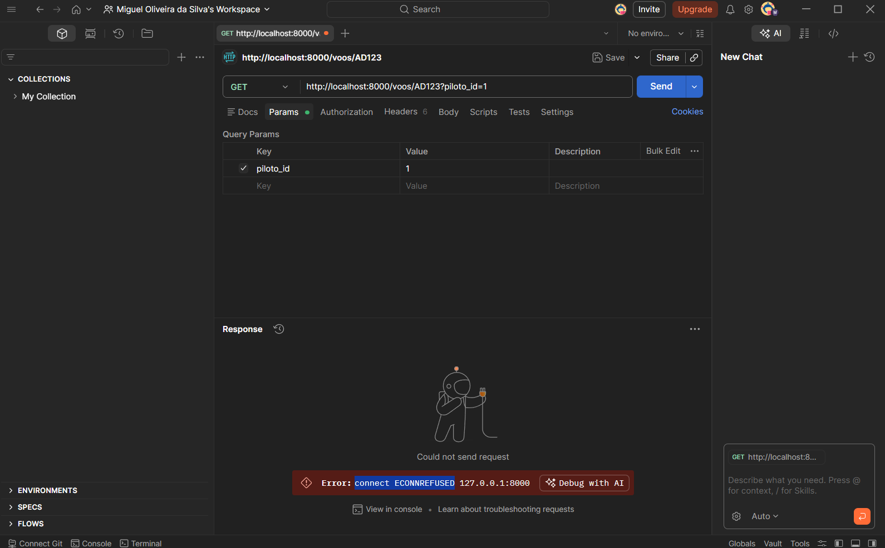
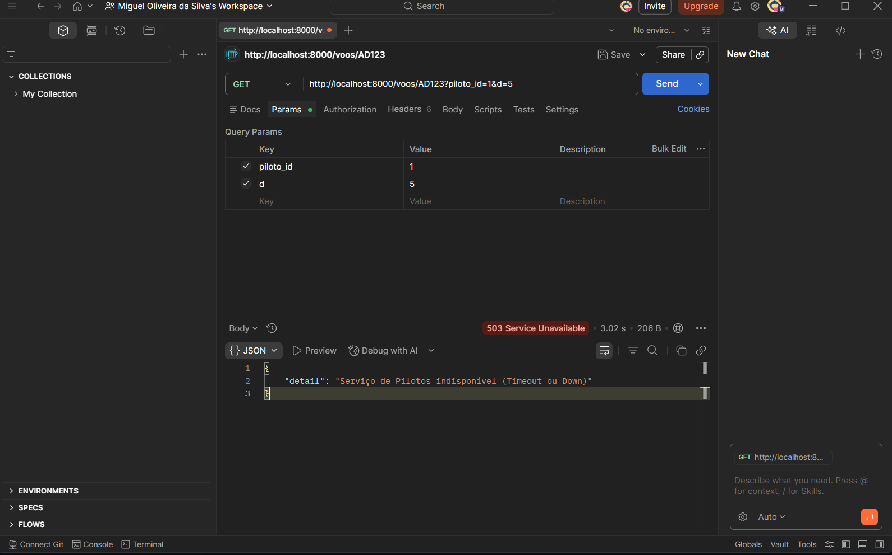

# Atividade_API_REST

Primeiro, você deve abrir o Visual Studio ou outra IDE. Depois, criar uma estrutura de pastas onde cada microserviço deve ter uma pasta com um arquivo requirements.txt (onde estão as bibliotecas para o Docker baixar na hora da execução), um main.py (onde vai estar o microserviço em si) e um Dockerfile (que vai dizer para o Docker como montar o servidor, ou seja, qual linguagem, sua versão e a porta de rede que vai ser usada, mesmo que seja localhost). E fora dessas duas pastas, tem que estar o docker-compose.yml.

Depois de preparar o ambiente, usando o PowerShell com o Docker instalado, você usará o docker-compose para subir os dois microserviços de uma vez, criando uma rede virtual e ele também vai garantir que um sistema não vai funcionar enquanto o outro não subir, para evitar que dê um erro de conexão no início.

Depois de subir os dois serviços, dá para usar o navegador ou o Postman (que é melhor para testes) para a execução, usando uma ID com o identificador do voo via rota e o ID do piloto via parâmetro de busca.

#ERROS
Se na UID digitarmos um valor de ID de pioloto que não existe o serviço de Voos recebe vai receber a requisição, ele faz uma chamada interna para o serviço de Pilotos que quando não encontra um id correspondente retorna que o recurso não existe

Se um dos serviços quando um dos serviço tentar "chamar" (fazer uma requisição) ao outro ele não vai encontrar nada e voltar 503. Da para testar isso forçando o docker a parar um dos serviços (se parar os dois 

*se os dois serviços caem a porta de rede ja é desabilitada e da outro erro connect ECONNREFUSED que não tem codigo porque o protocolo HTTP nem entrou em execução

Dependendo de como o serviço foi escrito ira retornar o erro 503 também ou seja se pilotos fizer uma requisição (programado para esperar 3s) e voos demorar 5s para responder ira retonar erro também o que pode se tornan um gargalo dependendo da escala de requisições. (nesse caso foi colocado de forma forçad um timeout).

#PROBLEMAS QUE PODEM OCORRRER

Neste tipo de implementação, o principal problema é o acoplamento temporal, pois o funcionamento do serviço de voos depende totalmente da disponibilidade imediata do serviço de pilotos. Se o serviço de pilotos estiver offline ou apresentar lentidão, o serviço de voos não consegue completar a tarefa, o que pode gerar um efeito dominó onde a falha de um componente derruba o sistema inteiro (no caso de um sistema com mais componentes)

Outro problema é o gargalo de desempenho e o esgotamento de recursos. Como a comunicação é síncrona, o serviço que faz a chamada fica ocupado aguardando a resposta do outro. Em larga escala, se houver um atraso na rede ou no processamento, as conexões podem se acumular até causar o travamento de todos os serviços e não ter um sistema de retentativas ou de uma fila de mensagens torna a arquitetura mais vulnerável a falhas momentâneas.

