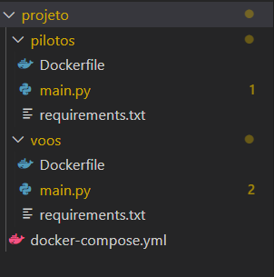
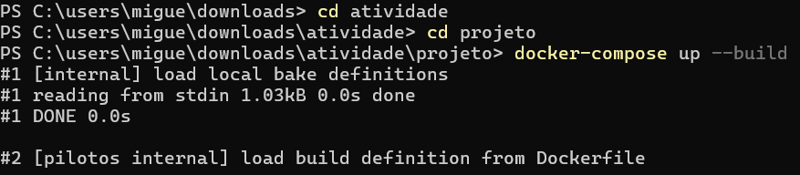
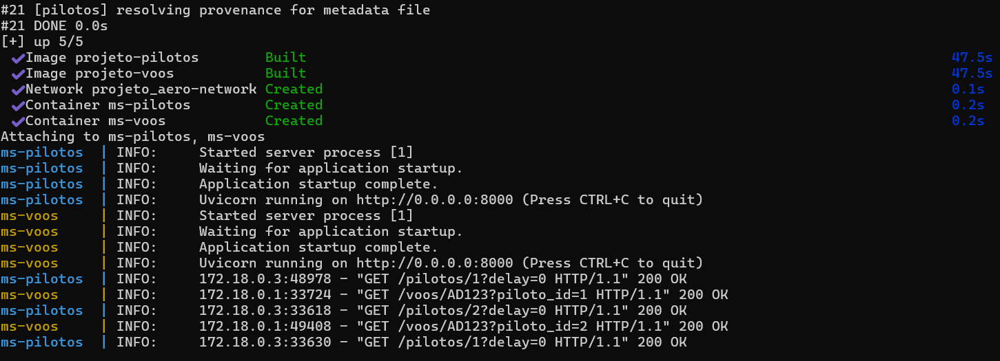
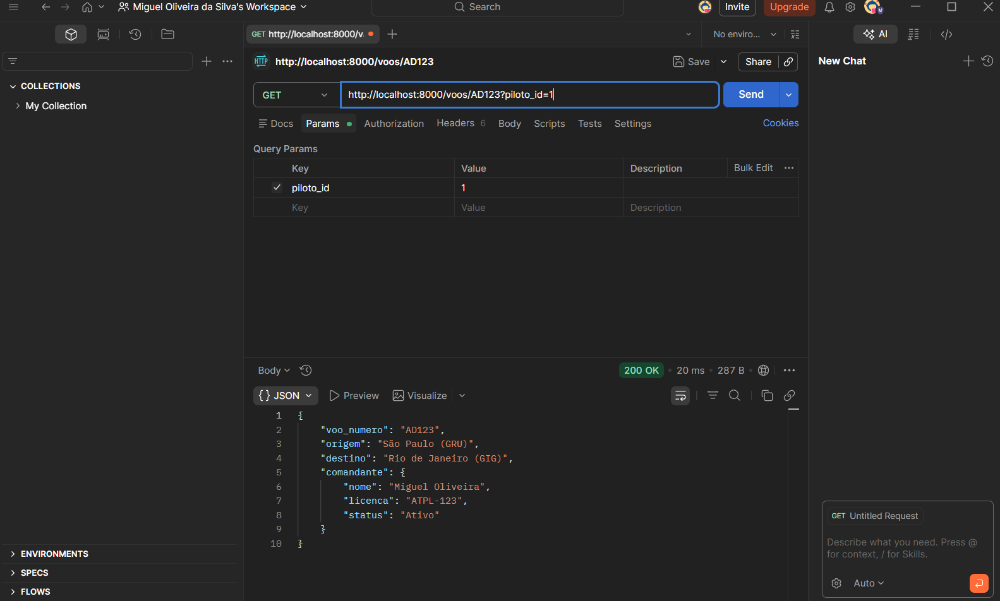

# Atividade_API_REST

Primeiro voce deve abrir o Visial studio ou outra IDE
Depois criar uma estrutura de pastas onde cada microsserviço deve ter uma pasta com um arquivo .txt (onde estão as bibliotecas para o docker baixar na hora da execução), um main.py (onde vai estar o microserviço em si) e um dockerfile (que vai "dizer" para o docker como montar o servidor ou seja qual linguagem sua versão e a porta de rede que vai ser usada (mesmo que seja local host). e fora dessas duas pastas tem que estar o docker-compose.yml.

Depois de preparar o ambiente, usando o power shell com o docker instalado você usara docker-compose para subir os dois microsserviçoes de uma vez, criar uma rede virtual e ele também vai garantir que um sistema não vai funcionar enquanto o outro não subir para evitar que de erro de conexão no inicio.

Depois de subir os dois serviços da

